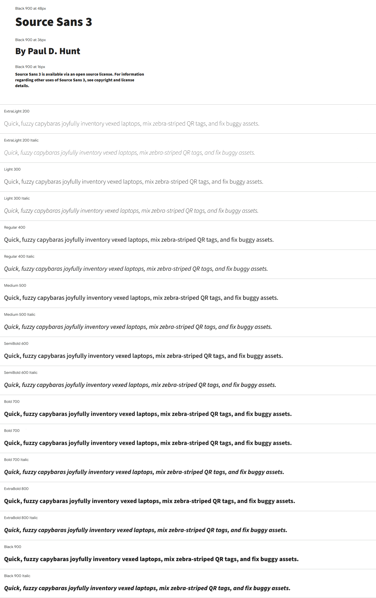

Branding Guidelines
===================

Brand name
----------

Our brand name is officially **Capybara**. While it is technically an acronym (for "Capturing Assets' Positions Yields Better Analytics, Reporting, and Assignments"), it should always be presented in Capital Case, and *never* be rendered C.A.P.Y.B.A.R.A.

Acceptable use
--------------

Capybara logos and other brand trademarks are available for use under the
`CC-BY 4.0` license. This license is valid as long as you **do not**:

* alter our logos in any way
* place a logo in such close proximity to other content that it is
  indistinguishable
* make our logo the most distinctive or prominent feature on your website,
  printed material or other content
* use our logos in a way that suggests any type of association or partnership
  with Capybara or approval, sponsorship or endorsement by Capybara
  (unless allowed via a license from the orignal authors)
* use our logos in a way that is harmful, deceptive, obscene or otherwise
  objectionable to the average person
* use our logos on websites or other places containing content associated with
  hate speech, pornography, gambling or illegal activities
* use our logos to, or in connection with, content that disparages us or sullies
  our reputation

Logos
-----

.. container:: logos-400

  .. figure:: _static/assets/logos/logo_stacked-gray_light.png
  :Recommended display width: 400px
  
  :Use: Light version for use on light backgrounds
  :License: CC-BY 4.0
  :PNG: :download:`logo_stacked-gray_light.png <_static/assets/logos/logo_stacked-gray_light.png>`
  
  .. figure:: _static/assets/logos/logo_stacked-sepia_light.png
  :Recommended display width: 400px
  
  :Use: Light version for use on light backgrounds
  :License: CC-BY 4.0
  :PNG: :download:`logo_stacked-sepia_light.png <_static/assets/logos/logo_stacked-sepia_light.png>`
  
  .. figure:: _static/assets/logos/logo_stacked_tagline-sepia_dark.png
  :Recommended display width: 400px
  
  :Use: Dark version for use on dark backgrounds
  :License: CC-BY 4.0
  :PNG: :download:`logo_stacked_tagline-sepia_dark.png <_static/assets/logos/logo_stacked_tagline-sepia_dark.png>`
  
  .. figure:: _static/assets/logos/logo_stacked_tagline-sepia_light.png
  :Recommended display width: 400px
  
  :Use: Light version for use on light backgrounds
  :License: CC-BY 4.0
  :PNG: :download:`logo_stacked_tagline-sepia_light.png <_static/assets/logos/logo_stacked_tagline-sepia_light.png>`
  
  .. figure:: _static/assets/logos/logo_horizontal-gray_dark.png
  :Recommended display width: 400px
  
  :Use: Dark version for use on dark backgrounds
  :License: CC-BY 4.0
  :PNG: :download:`logo_horizontal-gray_dark.png <_static/assets/logos/logo_horizontal-gray_dark.png>`
  
  .. figure:: _static/assets/logos/logo_horizontal-gray_light.png
  :Recommended display width: 400px
  
  :Use: Light version for use on light backgrounds
  :License: CC-BY 4.0
  :PNG: :download:`logo_horizontal-gray_light.png <_static/assets/logos/logo_horizontal-gray_light.png>`
  
  .. figure:: _static/assets/logos/logo_horizontal-sepia_dark.png
  :Recommended display width: 400px
  
  :Use: Dark version for use on dark backgrounds
  :License: CC-BY 4.0
  :PNG: :download:`logo_horizontal-sepia_dark.png <_static/assets/logos/logo_horizontal-sepia_dark.png>`
  
  .. figure:: _static/assets/logos/logo_horizontal-sepia_light.png
  :Recommended display width: 400px
  
  :Use: Light version for use on light backgrounds
  :License: CC-BY 4.0
  :PNG: :download:`logo_horizontal-sepia_light.png <_static/assets/logos/logo_horizontal-sepia_light.png>`
  
  .. figure:: _static/assets/logos/wordmark-blue.png
  :Recommended display width: 400px
  
  :Use: Blue wordmark for use on light backgrounds
  :License: CC-BY 4.0
  :PNG: :download:`wordmark-blue.png <_static/assets/logos/wordmark-blue.png>`
  
  .. figure:: _static/assets/logos/wordmark-gray_dark.png
  :Recommended display width: 400px
  
  :Use: Dark version for use on dark backgrounds
  :License: CC-BY 4.0
  :PNG: :download:`wordmark-gray_dark.png <_static/assets/logos/wordmark-gray_dark.png>`
  
  .. figure:: _static/assets/logos/wordmark-gray_light.png
  :Recommended display width: 400px
  
  :Use: Light version for use on light backgrounds
  :License: CC-BY 4.0
  :PNG: :download:`wordmark-gray_light.png <_static/assets/logos/wordmark-gray_light.png>`
  
  .. figure:: _static/assets/logos/wordmark-gray_medium.png
  :Recommended display width: 400px
  
  :Use: Medium contrast version for light backgrounds
  :License: CC-BY 4.0
  :PNG: :download:`wordmark-gray_medium.png <_static/assets/logos/wordmark-gray_medium.png>`
  
  .. figure:: _static/assets/logos/wordmark-sepia_dark.png
  :Recommended display width: 400px
  
  :Use: Dark version for use on dark backgrounds
  :License: CC-BY 4.0
  :PNG: :download:`wordmark-sepia_dark.png <_static/assets/logos/wordmark-sepia_dark.png>`
  
  .. figure:: _static/assets/logos/wordmark-sepia_light.png
  :Recommended display width: 400px
  
  :Use: Light version for use on light backgrounds
  :License: CC-BY 4.0
  :PNG: :download:`wordmark-sepia_light.png <_static/assets/logos/wordmark-sepia_light.png>`

.. container:: logos-250

  .. figure:: _static/assets/logos/mascot-gray_dark.png
  :Recommended display width: 250px
  
  :Use: Dark version for use on dark backgrounds
  :License: CC-BY 4.0
  :PNG: :download:`mascot-gray_dark.png <_static/assets/logos/mascot-gray_dark.png>`
  
  .. figure:: _static/assets/logos/mascot-gray_light-xlarge.png
  :Recommended display width: 250px
  
  :Use: High-resolution light version for use on light backgrounds
  :License: CC-BY 4.0
  :PNG: :download:`mascot-gray_light-xlarge.png <_static/assets/logos/mascot-gray_light-xlarge.png>`
  
  .. figure:: _static/assets/logos/mascot-gray_light.png
  :Recommended display width: 250px
  
  :Use: Light version for use on light backgrounds
  :License: CC-BY 4.0
  :PNG: :download:`mascot-gray_light.png <_static/assets/logos/mascot-gray_light.png>`
  
  .. figure:: _static/assets/logos/mascot-sepia_dark.png
  :Recommended display width: 250px
  
  :Use: Dark version for use on dark backgrounds
  :License: CC-BY 4.0
  :PNG: :download:`mascot-sepia_dark.png <_static/assets/logos/mascot-sepia_dark.png>`
  
  .. figure:: _static/assets/logos/mascot-sepia_light-xlarge.png
  :Recommended display width: 250px
  
  :Use: High-resoltion light version for use on light backgrounds
  :License: CC-BY 4.0
  :PNG: :download:`mascot-sepia_light-xlarge.png <_static/assets/logos/mascot-sepia_light-xlarge.png>`
  
  .. figure:: _static/assets/logos/mascot-sepia_light.png
  :Recommended display width: 250px
  
  :Use: Light version for use on light backgrounds
  :License: CC-BY 4.0
  :PNG: :download:`mascot-sepia_light.png <_static/assets/logos/mascot-sepia_light.png>`

.. container:: logos-189
  
  .. figure:: _static/assets/logos/initial-blue.png
  :Recommended display width: 189px
  
  :Use: Blue initial mark for use on light backgrounds
  :License: CC-BY 4.0
  :PNG: :download:`initial-blue.png <_static/assets/logos/initial-blue.png>`
  
  .. figure:: _static/assets/logos/initial-gray_dark.png
  :Recommended display width: 189px
  
  :Use: Dark version for use on light backgrounds
  :License: CC-BY 4.0
  :PNG: :download:`initial-gray_dark.png <_static/assets/logos/initial-gray_dark.png>`
  
  .. figure:: _static/assets/logos/initial-gray_light.png
  :Recommended display width: 189px
  
  :Use: Light version for use on light backgrounds
  :License: CC-BY 4.0
  :PNG: :download:`initial-gray_light.png <_static/assets/logos/initial-gray_light.png>`
  
  .. figure:: _static/assets/logos/initial-gray_medium.png
  :Recommended display width: 189px
  
  :Use: Medium contrast version for light backgrounds
  :License: CC-BY 4.0
  :PNG: :download:`initial-gray_medium.png <_static/assets/logos/initial-gray_medium.png>`
  
  .. figure:: _static/assets/logos/initial-sepia_dark.png
  :Recommended display width: 189px
  
  :Use: Dark version for use on light backgrounds
  :License: CC-BY 4.0
  :PNG: :download:`initial-sepia_dark.png <_static/assets/logos/initial-sepia_dark.png>`
  
  .. figure:: _static/assets/logos/initial-sepia_light.png
  :Recommended display width: 189px
  
  :Use: Light version for use on light backgrounds
  :License: CC-BY 4.0
  :PNG: :download:`initial-sepia_light.png <_static/assets/logos/initial-sepia_light.png>`

License
-------

All logos and branding images are, except where noted, available under
the `CC-BY 4.0`_ copyright license. This guideline is adapted from the
`Firefox Branding Guideline`_

.. _CC-BY 4.0: http://creativecommons.org/licenses/by/4.0/
.. _Firefox Branding Guideline: https://www.mozilla.org/en-US/styleguide/identity/firefox/branding/

Fonts
-----
The official typefaces of Capybara are Adobe's free and open-source **Source Sans 3** and **Source Code Pro**, both by Paul D. Hunt. Titles, headings and body copy are rendered in **Source Sans 3**, while **Source Code Pro** is used for inline code and code blocks.

:Use: For titles, headings, and body copy
:License: `OFL` (SIL **Open Font License**, Version 1.1)
:ZIP: :download:`source_sans_3.zip <_static/assets/fonts/source_sans_3.zip>`

:Use: For inline code and code blocks
:License: `OFL` (SIL **Open Font License**, Version 1.1)
:ZIP: :download:`source_code_pro.zip <_static/assets/fonts/source_code_pro.zip>`
